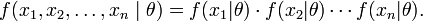
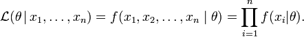
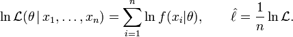
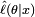
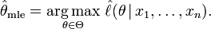

As learned from the previous experiment, if we have a generative model for each of the classes, one can devlop a classifier that assigns an unknown sample to one of the possible set of classes.

Suppose there is a sample x1, x2, ..., xn of n iid observations, coming from a distribution with an unknown pdf ƒ0(·). It is however surmised that the function ƒ0 belongs to a certain family of distributions { ƒ(·|θ), θ ∈ Θ }, called the parametric model, so that ƒ0 = ƒ(·|θ0). The value θ0 is unknown and is referred to as the "true value" of the parameter. It is desirable to find some estimator which would be as close to the true value θ0 as possible. Both the observed variables x0 and the parameter θ can be vectors.

To use the method of maximum likelihood, one first specifies the joint density function for all the the observations. For an Independent and Identically distributed distribution, this joint density function will be

Now we look at this function from a different perspective by considering the observed values x1, x2, ..., xn to be fixed “parameters” of this function, whereas θ will be the function’s variable and allowed to vary freely. From this point of view this distribution function will be called the likelihood:

In practice it is often more convenient to work with the logarithm of the likelihood function, called the log-likelihood, or its scaled version, called the average log-likelihood:

The method of maximum likelihood estimates θ0 by finding a value of θ that maximizes . This method of estimation is a maximum likelihood estimator (MLE) of θ0:

A MLE estimate is the same regardless of whether we maximize the likelihood or the log-likelihood function, since log is a monotone transformation. For many models, a maximum likelihood estimator can be found as an explicit function of the observed data x1,..., xn. For many other models, however, no closed-form solution to the maximization problem is known or available, and a MLE has to be found numerically using optimization methods. For some problems, there may be multiple estimates that maximize the likelihood. For other problems, no maximum likelihood estimate exists (meaning that the log-likelihood function increases without attaining the supremum value).

A maximum likelihood estimator coincides with the most probable Bayesian estimator given a uniform prior distribution on the parameters.

Example for a Normal Distribution, Bernoulli distribution and Poisson distribution:

See the page [http://mathworld.wolfram.com/MaximumLikelihood.html](https://mathworld.wolfram.com/MaximumLikelihood.html)
